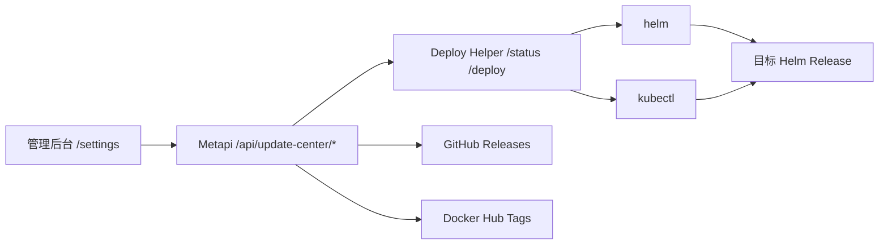

# ☸️ K3s 更新中心

[返回部署指南](./deployment.md) · [返回文档中心](./README.md)

---

K3s 更新中心用于在 Metapi 管理后台里统一查看当前运行版本、GitHub Releases、Docker Hub 标签，以及集群内 Deploy Helper 的健康状态，并在确认后手动触发一次 Helm 升级。

> [!IMPORTANT]
> 当前这套能力是“检查更新 + 手动触发部署”，不是自动升级器。
>
> 它不会定时自动发布，不会无人值守地升级集群，也不会替你推断任意仓库/镜像仓库的版本源。

## 它能做什么

- 在设置页检查当前 Metapi 运行版本。
- 从官方 GitHub Releases 查找最新稳定版。
- 从官方 Docker Hub 标签查找最新稳定版。
- 通过一个独立的 Deploy Helper 在集群内执行 `helm upgrade`。
- 在页面中实时回看部署日志；日志流中断时自动回退到任务快照。

## 当前边界

- 版本源目前固定为 Metapi 官方源：
  - GitHub：`cita-777/metapi`
  - Docker Hub：`1467078763/metapi`
- 只识别稳定 SemVer，例如 `v1.2.3` 或 `1.2.3`。
- helper 假设你的 Helm chart 使用以下 values：
  - `image.repository`
  - `image.tag`
- helper 会通过 `app.kubernetes.io/instance=<releaseName>` 这个标签等待 `kubectl rollout status`。

## 组件关系



## 前置条件

在开始之前，请先确认下面几点成立：

- 目标 Metapi 是通过 Helm release 部署的，而不是直接裸 `kubectl apply`。
- 你的 chart 支持通过 `image.repository` / `image.tag` 覆盖镜像。
- 目标 Deployment 带有 `app.kubernetes.io/instance=<releaseName>` 标签。
- 主 Metapi 服务可以访问：
  - GitHub API
  - Docker Hub API
  - Deploy Helper 的集群内地址
- 主 Metapi 和 Deploy Helper 共享同一个 Bearer Token。

## 第一步：部署 Deploy Helper

仓库里已经带了一个最小示例清单：

- `deploy/k3s/metapi-deploy-helper.yaml`

建议先复制或按需修改，再部署到你的集群。

### 需要改的地方

部署前至少确认这几项：

- `namespace`
  - 示例里写死为 `ai`。
- `DEPLOY_HELPER_TOKEN`
  - 必须改成高强度随机字符串，主 Metapi 端也要使用同一个值。
- `image`
  - 默认是 `1467078763/metapi:latest`。
  - 如果你更希望 helper 和主服务版本保持一致，建议改成明确的镜像 tag。

### 最小部署命令

```bash
kubectl create namespace ai
kubectl apply -f deploy/k3s/metapi-deploy-helper.yaml
```

### helper 自身环境变量

| 变量 | 说明 | 默认值 |
|------|------|--------|
| `DEPLOY_HELPER_HOST` | helper 监听地址 | `0.0.0.0` |
| `DEPLOY_HELPER_PORT` | helper 监听端口 | `9850` |
| `DEPLOY_HELPER_TOKEN` | helper Bearer Token，主服务必须使用同一个值 | 无，必填 |

helper 入口位于 `src/server/update-helper/index.ts`。

### helper 暴露的接口

| 方法 | 路径 | 用途 | 是否需要 Bearer Token |
|------|------|------|-----------------------|
| `GET` | `/health` | 存活探针 | 否 |
| `GET` | `/status` | 查询 release 当前 revision / image / 健康状态 | 是 |
| `POST` | `/deploy` | 执行部署；`Accept: text/event-stream` 时返回实时日志 | 是 |

接口定义位于 `src/server/update-helper/app.ts`。

> [!WARNING]
> 目前仓库里的示例清单使用的是 `ClusterRole admin` 绑定到命名空间内的 ServiceAccount，只适合先跑通链路。
>
> 生产环境建议把它收窄成最小权限 Role，只保留 Helm/Kubectl 真正需要的资源和 verbs。

## 第二步：给主 Metapi 配 helper token

主 Metapi 服务端会从下面两个环境变量里读取 token，优先级从前到后：

- `DEPLOY_HELPER_TOKEN`
- `UPDATE_CENTER_HELPER_TOKEN`

这两个变量只需要设置一个，但值必须和 helper 端保持一致。相关逻辑位于 `src/server/routes/api/updateCenter.ts`。

例如在你的主服务部署里：

```yaml
env:
  - name: DEPLOY_HELPER_TOKEN
    valueFrom:
      secretKeyRef:
        name: metapi-deploy-helper-auth
        key: DEPLOY_HELPER_TOKEN
```

## 第三步：在管理后台填写更新中心配置

设置页入口在管理后台的“设置 → 更新中心”。

打开“设置 → 更新中心”后，至少要填下面这些字段：

| 字段 | 怎么填 | 典型示例 |
|------|--------|----------|
| `Deploy Helper URL` | helper 的集群内访问地址 | `http://metapi-deploy-helper.ai.svc.cluster.local:9850` |
| `Namespace` | 目标 release 所在命名空间 | `ai` |
| `Release Name` | Helm release 名称 | `metapi` |
| `Chart Ref` | Helm chart 引用 | `oci://ghcr.io/cita-777/charts/metapi` |
| `Image Repository` | 升级时要写入的镜像仓库 | `1467078763/metapi` |
| `默认部署来源` | GitHub 或 Docker Hub | `GitHub Releases` |

另外还有 3 个开关：

- `启用更新中心`
  - 不开的话只能看到配置，不能部署。
- `GitHub Releases`
  - 控制是否检查 GitHub 稳定版。
- `Docker Hub`
  - 控制是否检查 Docker Hub 稳定版。

这些字段都会持久化进运行数据库里的 settings 表，结构定义位于 `src/server/services/updateCenterConfigService.ts`。

## 第四步：实际使用顺序

建议按下面的顺序操作：

1. 填完配置后先点“保存更新中心配置”。
2. 再点“检查更新”。
3. 观察页面里的三个状态：
   - 当前运行版本
   - 版本来源是否发现可部署版本
   - Deploy Helper 是否 `Healthy`
4. 确认 helper 健康后，再点击：
   - “部署 GitHub 稳定版”
   - 或“部署 Docker Hub 标签”
5. 在页面下方查看实时日志。
6. 如果实时日志流断开，页面会自动回退到任务详情快照，不会直接丢失最近一轮任务状态。

前端交互实现位于 `src/web/pages/settings/UpdateCenterSection.tsx`。

## helper 实际执行的命令

当你点击部署时，helper 的执行顺序大致如下：

1. `helm history <releaseName> -n <namespace> -o json`
2. `helm upgrade <releaseName> <chartRef> --reuse-values --set image.repository=... --set image.tag=...`
3. `kubectl rollout status deployment -n <namespace> -l app.kubernetes.io/instance=<releaseName> --timeout=300s`
4. 成功后执行 `helm status`
5. 如果 rollout 失败且存在旧 revision，则尝试 `helm rollback`

实现位于 `src/server/update-helper/service.ts`。

## 常见排障

### 页面一直显示 helper 不可用

优先检查：

- `Deploy Helper URL` 是否能从主 Metapi 容器访问。
- 主 Metapi 上是否配置了 `DEPLOY_HELPER_TOKEN`。
- helper 上的 `DEPLOY_HELPER_TOKEN` 是否与主服务一致。
- helper Pod 是否存活，`/health` 是否返回 200。

### 能检查版本，但部署按钮是灰的

部署按钮被禁用通常是下面几种情况之一：

- 没开启“更新中心”
- 对应来源开关被关闭
- helper 不健康
- 当前来源没有发现稳定版本

### 点击部署后失败

优先核对：

- `Namespace` 是否正确
- `Release Name` 是否真的是 Helm release 名
- `Chart Ref` 是否可被 helper 容器拉取
- 目标 chart 是否支持 `image.repository` / `image.tag`
- Deployment 是否有 `app.kubernetes.io/instance=<releaseName>` 标签

### 页面显示“未发现版本”

当前版本选择只认稳定 SemVer：

- 会识别：`v1.2.3`、`1.2.3`
- 不会识别：`latest`、`nightly`、`1.2.3-beta.1`

## 已知限制

- 目前没有“发现新版本后自动部署”的调度器。
- 目前没有多仓库、多镜像源的通用配置能力。
- helper 是集群内执行 `helm` / `kubectl` 的薄代理，不负责发布审批、灰度、分批流量切换等高级发布策略。
- About 页只展示更新提醒入口，不承担完整操作；完整配置与部署入口仍在“设置 → 更新中心”。

## 相关入口

- [部署指南](./deployment.md)
- [配置说明](./configuration.md)
- [运维手册](./operations.md)
